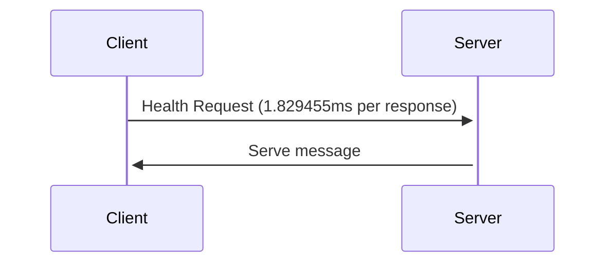
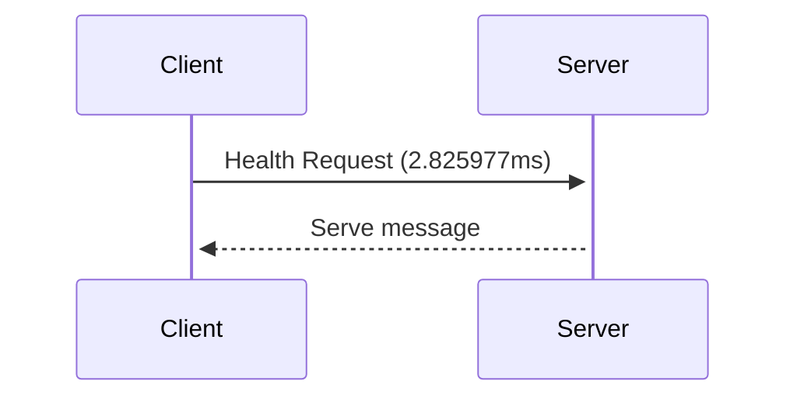

# GRPC over unix socket Protocol

Unix sockets, or Unix Domain Sockets, allow bidirectional data exchange between processes running on the same machine.
In order to transmit data between processes, the file system provides a reliable and efficient mechanism. The kernel is the only component involved in communication between processes. The processes communicate by reading and writing to the same socket file, which is managed by the kernel. Kernels handle communication details, such as synchronization, buffering, and error handling, and ensure that data is delivered reliably and correctly.

**Advantage :** 
- Fast communication 
- Efficient
- Low overhead
- Stability

**Disadvantages :**
- Limited on same machine



```shell
$ netstat -a -p --unix | grep grpc

(Not all processes could be identified, non-owned process info
 will not be shown, you would have to be root to see it all.)
unix  2      [ ACC ]     STREAM     LISTENING     119977   98036/main           /tmp/grpc.sock
```

A TCP/IP socket is a mechanism for communicating between processes over a network.




## Test Benchmark and profiling

- Profile result over unix socket 10k request ([Profiling Visualization Image](https://raw.githubusercontent.com/Ja7ad/grpc-unix-socket/master/client/socket/unix.svg)):

```shell
2022/12/07 08:53:42 9999 : server status is SERVING
2022/12/07 08:53:42 10k request to unix socket took 1.400293876s 
```

- Profile result over TCP 10k request ([Profiling Visualization Image](https://raw.githubusercontent.com/Ja7ad/grpc-unix-socket/master/client/tcp/tcp.svg)):

```shell
2022/12/07 08:52:52 9999 : server status is SERVING
2022/12/07 08:52:52 10k request to tcp protocol took 1.726000498s 
```

## UseCase

When you run many services on the same machine and run them in containers or hosts, you can use unix sockets for efficient and fast communication.

Containers need to share sock files via volumes, since unix sockets are over socket files.

## How to test server/client?

Server :
- run server in `server` folder (go1.19) :
```shell
$ go run -mod vendor main.go
```

Client :
- run client tcp or socket in `client` folder :
```shell
$ go run -mod vendor main.go
```
