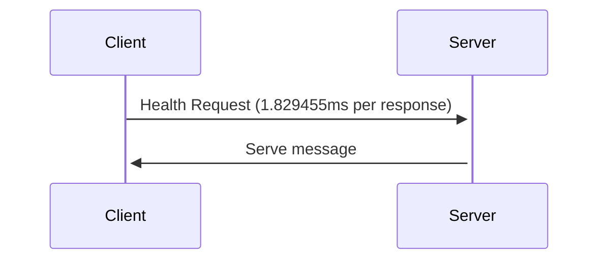
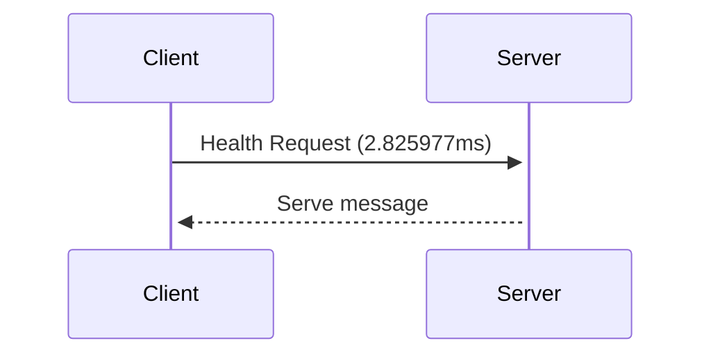

# GRPC over unix socket Protocol

Unix sockets, or Unix Domain Sockets, allow bidirectional data exchange between processes running on the same machine.
In order to transmit data between processes, the file system provides a reliable and efficient mechanism. The kernel is the only component involved in communication between processes. The processes communicate by reading and writing to the same socket file, which is managed by the kernel. Kernels handle communication details, such as synchronization, buffering, and error handling, and ensure that data is delivered reliably and correctly.

**Advantage :** 
- Fast communication 
- Efficient
- Low overhead
- Stability

**Disadvantages :**
- Limited on same machine



```shell
$ netstat -a -p --unix | grep grpc

(Not all processes could be identified, non-owned process info
 will not be shown, you would have to be root to see it all.)
unix  2      [ ACC ]     STREAM     LISTENING     119977   98036/main           /tmp/grpc.sock
```

A TCP/IP socket is a mechanism for communicating between processes over a network.




## Test Benchmark and profiling

- Profile result over unix socket 100k request ([Profiling Visualization Image](https://raw.githubusercontent.com/Ja7ad/grpc-unix-socket/master/assets/unix.svg)):

```shell
goos: linux
goarch: amd64
pkg: github.com/Ja7ad/grpc-unix-socket/server
cpu: Intel(R) Core(TM) i5-3570 CPU @ 3.40GHz
Benchmark_UNIX
Benchmark_UNIX-4          100000            102187 ns/op            4960 B/op         96 allocs/op
```

- Profile result over TCP 100k request ([Profiling Visualization Image](https://raw.githubusercontent.com/Ja7ad/grpc-unix-socket/master/assets/tcp.svg)):

```shell
goos: linux
goarch: amd64
pkg: github.com/Ja7ad/grpc-unix-socket/server
cpu: Intel(R) Core(TM) i5-3570 CPU @ 3.40GHz
Benchmark_TCP
Benchmark_TCP-4           100000            127188 ns/op            4961 B/op         96 allocs/op
```

### Result of 100k benchmark with 20 time test as new/old (benchstat)

```shell
name     old time/op    new time/op    delta
_UNIX-4     100µs ± 2%     100µs ± 2%    ~     (p=0.668 n=17+20)
_TCP-4      125µs ± 1%     124µs ± 1%  -0.15%  (p=0.031 n=20+20)

name     old alloc/op   new alloc/op   delta
_UNIX-4    4.96kB ± 0%    4.96kB ± 0%    ~     (p=0.454 n=20+20)
_TCP-4     4.96kB ± 0%    4.96kB ± 0%    ~     (all equal)

name     old allocs/op  new allocs/op  delta
_UNIX-4      96.0 ± 0%      96.0 ± 0%    ~     (all equal)
_TCP-4       96.0 ± 0%      96.0 ± 0%    ~     (all equal)
```

## UseCase

When you run many services on the same machine and run them in containers or hosts, you can use unix sockets for efficient and fast communication.

Containers need to share sock files via volumes, since unix sockets are over socket files.

## How to test server/client?

Server :
- run server (go1.19) :
```shell
$ go run -mod vendor grpc.go
```

- benchmark command :
```shell
$ go test -bench=. -benchtime=100000x -benchmem
```
