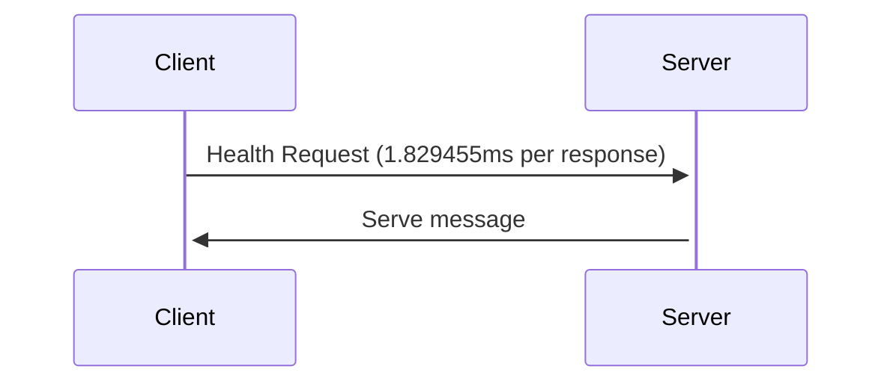
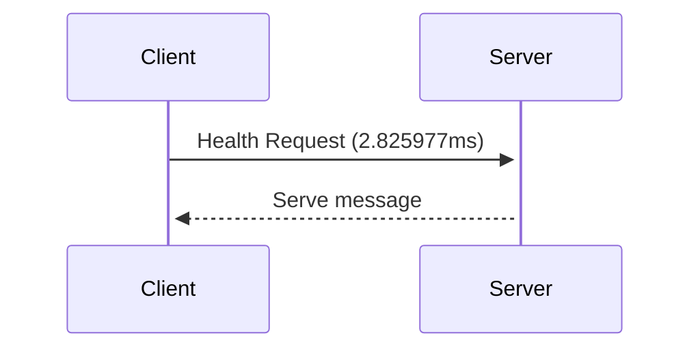

# GRPC over unix socket Protocol

Unix sockets, or Unix Domain Sockets, allow bidirectional data exchange between processes running on the same machine.

**Advantage :** 
- Fast communication 
- Efficient
- Low overhead
- Stability

**Disadvantages :**
- Limited on same machine



```shell
$ netstat -a -p --unix | grep grpc

(Not all processes could be identified, non-owned process info
 will not be shown, you would have to be root to see it all.)
unix  2      [ ACC ]     STREAM     LISTENING     119977   98036/main           /tmp/grpc.sock
```

A TCP/IP socket is a mechanism for communicating between processes over a network.




## Test Benchmark and profiling

- Profile result over unix socket 10k request ([Profiling Visualization Image](assets/unix.svg)):

```shell
goos: linux
goarch: amd64
pkg: github.com/Ja7ad/grpc-unix-socket/server
cpu: Intel(R) Core(TM) i5-3570 CPU @ 3.40GHz
Benchmark_UNIX
Benchmark_UNIX-4   	    8835	    125074 ns/op
```

- Profile result over TCP 10k request ([Profiling Visualization Image](assets/tcp.svg)):

```shell
goos: linux
goarch: amd64
pkg: github.com/Ja7ad/grpc-unix-socket/server
cpu: Intel(R) Core(TM) i5-3570 CPU @ 3.40GHz
Benchmark_TCP
Benchmark_TCP-4    	    7501	    147191 ns/op 
```

## UseCase

When you run many services on the same machine and run them in containers or hosts, you can use unix sockets for efficient and fast communication.

Containers need to share sock files via volumes, since unix sockets are over socket files.

## How to test server/client?

Server :
- run server (go1.19) :
```shell
$ go run -mod vendor main.go
```

- benchmark command :
```shell
$ go test -bench=.
```